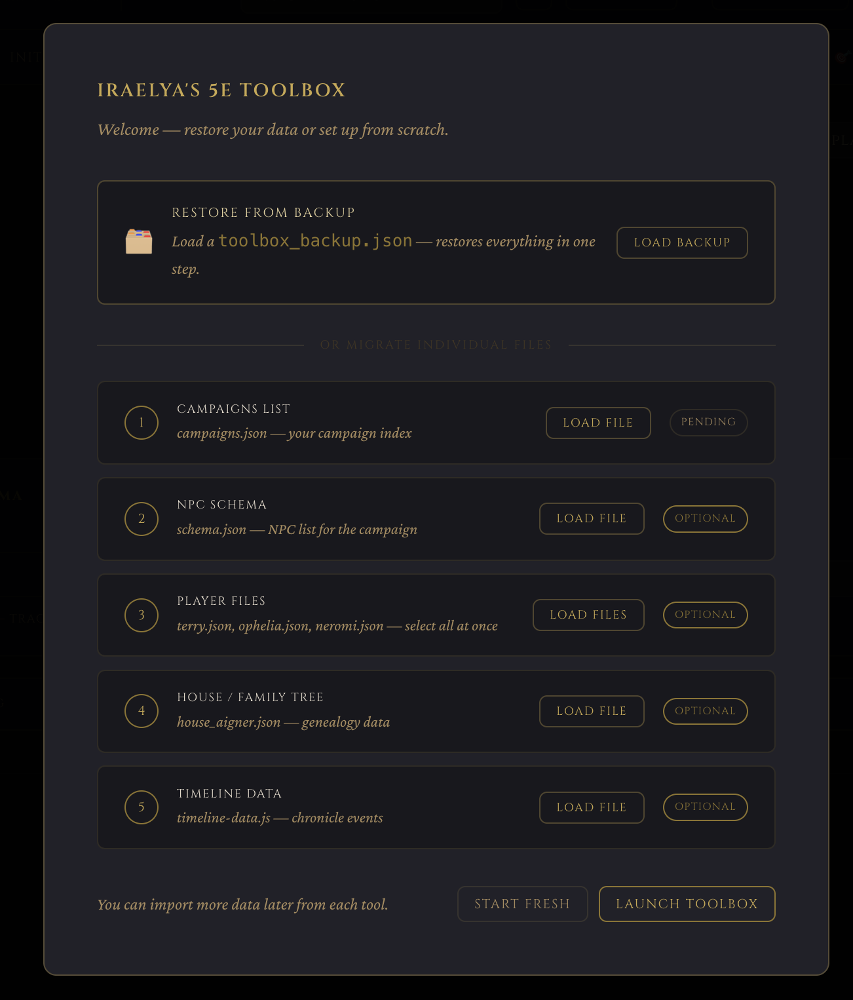

# Iraelya's 5e Toolbox

A Dungeon Master's dashboard for 5e campaigns. Built with Electron + Vite + TypeScript.

## How It Works

### Creating a Campaign
Upon launching the app, you will be prompted to either create a new project or import files from an old project. You will most likely want to create a new one unless you were one of the few people who used this app before the process changed to what it is today.



### Favor Tab
The first tab is the favor tab. This allows you to set up NPCs, their factions, and assign what level of favor each PC you made in the Party Tab has. You may also do things like assign custom favor tiers along with their color to signify if someone is liked, loved, hated, or anything else you can come up with.


Selecting "Enable NPC Editing" at the bottom allows you to edit or delete NPCs, change the tiers, colors, and the amount of favor incremented per click of the plus and minus button to allow control of granularity.


### Faction Tab
This is where you may assign ranks to the Factions, including adding PCs made in the Party Tab to the factions as well. NPCs from the favor tracker will be populated here by default and you may assign their ranks as well as the rank of your PCs if they have joined a faction.


### Initiative Tab
Here, you can handle initiative. You may populate the party from the list of PCs you made in the Party Tab. Click the "Prefil Party" and then enter their rolls. 


You may also add Enemy NPCs. Here, you can also click the roll for them instead of manually inputting. There is a button to add +1 to the base roll for NPCs who have bonuses to iniative. Rolling prefills the input. This is also true for Friendly NPCs if they are in the fight. The initiative tracker counts the current turn you are on up top, increments through the list as you click forwards and back, allows you to remove someone form the list, and allows for marking a person as "Incapacitated". An Incapacitated person simply means they are skipped over as the turn reaches them but remains in the list.


### Dice Roller
The dice roller... lets you roll dice! It also does a few more neat things. When rolling a d20, you can roll it with advantage and disadvantage as well. You may also add a modifier by entering it into the box. You may also click the +1 or +5 to increment the modifier by that amount. If you entered your PCs AC in the Party Tab, you will also see the chance to hit that PC based off what your current d20+mod average is. Select a PC from the dropdown.


There is also a "Spell Save" option. This obviously doesn't roll anything, but does tell you based on the specific what your hit odds are against the PCs if you entered their saves in the Party Tab.


### Conversation Tab
The conversation tab is for quickly assessing how conversations are going. You may prefil with the party or manually add people. This lets you slide up and down based on how convincing the PCs are in a given conversation or debate, giving you an average at the bottom of the entire party to allow you to quickly assess how a conversation is going.


### Family Tree
This allows you to quickly make family trees for important families like nobles. The feature is under construction still and will have many improvements down the line. You can currently add information like parents, a spousse, an adoptive parent. You can assign a row and column for the person, a note, and an image to represent them. 


Lines are drawn automatically based on the relationships and where they are located. Images are placed on the icons for that family member.


### Chronicle
This tab allows you to create your timeline. You may make different sections, change colors, place singluar events or spans.


You can edit this in the editor window setting your start year, end year, and the current year. Current year provides a quick button to move to the current time along with a marker of what the current year on the timeline is.


### Custom Trackers
As the name suggests, if you need to have anything specific to track that doesn't have a place, you can add it here. You may set warning break points at specific values to remind you of consequences or anything else.


### Party Tab
This tab is for managing your party. Put their AC, their saves, passive perception, insight, and investigation. Their current platinum and gold. Add custom fields if you want other info. Plat and Gold summary for the whole party is listed up top. Hovering over the values breaks down who each belongs to.


## For Users

### | Mac (Apple Silicon) | [Download](https://github.com/RSXII/iraelyas-toolbox/releases/latest/download/Iraelyas-5e-Toolbox-mac-arm64.dmg)

### | Mac (Intel) | [Download](https://github.com/RSXII/iraelyas-toolbox/releases/latest/download/Iraelyas-5e-Toolbox-mac-x64.dmg)

### | Windows | [Download](https://github.com/RSXII/iraelyas-toolbox/releases/latest/download/Iraelyas-5e-Toolbox-Setup-windows.exe)

Download the latest release from the [Releases page](https://github.com/RSXII/iraelyas-toolbox/releases):

- **Mac**: Download the `.dmg`, open it, drag the app to Applications
- **Windows**: Download the `.exe` installer and run it

On first launch you'll see a setup screen to either restore from a backup or import your existing data files.

## For Developers

### Prerequisites

- [Node.js](https://nodejs.org/) v20+
- npm (comes with Node)

### Setup

```bash
git clone https://github.com/RSXII/iraelyas-toolbox.git
cd iraelyas-toolbox
npm install
```

### Development

```bash
npm run dev
```

This starts Vite's dev server and opens Electron with hot reload. Changes to TypeScript and CSS reflect immediately.

### Type checking

```bash
npm run typecheck
```

### Building installers

```bash
# Mac only
npm run dist:mac

# Windows only (or from Mac via cross-compile)
npm run dist:win

# Both
npm run dist:all
```

Output goes to `dist/installers/`.

### Releases

Push a version tag to trigger the GitHub Actions CI build:

```bash
git tag v1.0.0
git push origin v1.0.0
```

The workflow builds Mac (`.dmg`) and Windows (`.exe`) installers and attaches them to a GitHub Release automatically.

## Data

App data is stored at:

- **Mac**: `~/Library/Application Support/iraelyas-toolbox/toolbox-data.json`
- **Windows**: `%APPDATA%\iraelyas-toolbox\toolbox-data.json`

Use **Export Backup** in the app to save a portable copy. Use **Import Backup** to restore.

## App Icon

The placeholder icon is at `assets/icon.svg`. To ship proper icons:

1. Replace `assets/icon.svg` with your design
2. Generate `assets/icon.icns` (Mac) using `iconutil` or an online converter
3. Generate `assets/icon.ico` (Windows) using an online converter
4. electron-builder will pick them up automatically

## License

MIT
